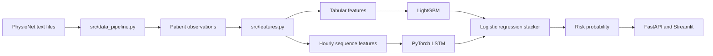
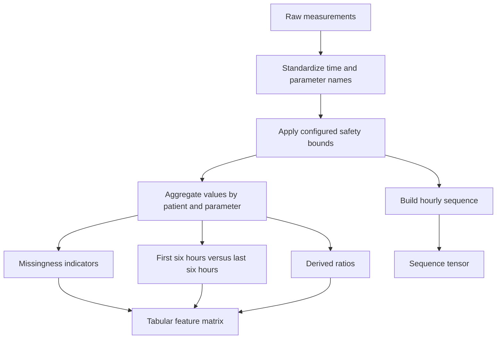
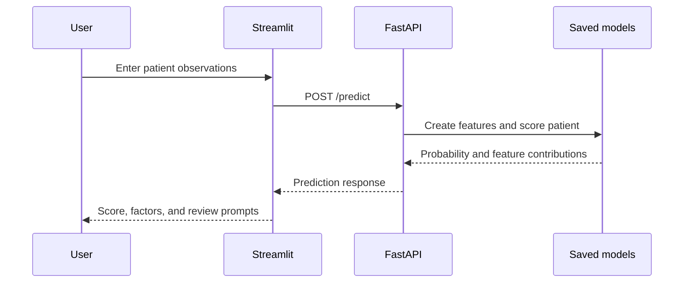

# Early ICU Outcome Analysis

This project uses the first 48 hours of ICU measurements to estimate whether a patient
will die during the hospital stay. It was built as a learning and portfolio project
using the PhysioNet Computing in Cardiology Challenge 2012 dataset.

It is not a clinical tool and should not be used to make treatment decisions.

## Why this project

The main question is:

> Can early vital signs and laboratory measurements provide a useful estimate of
> in-hospital mortality risk?

The project covers the full workflow:

- reading the original PhysioNet text files
- cleaning and aggregating measurements from the first 48 hours
- handling missing clinical values
- training tabular and sequence models
- evaluating the models on held-out data
- displaying risk estimates and important features in a small web application

### Project flow

This is the main path through the project:



## Dataset

The project uses the PhysioNet/CinC Challenge 2012 dataset. The data contains ICU
stays with measurements such as heart rate, blood pressure, temperature, Glasgow Coma
Scale, blood tests, and urine output.

The repository expects the data to be arranged like this:

```text
data/raw/
|-- set-a/
|-- set-b/
  |-- early_icu_outcome_analysis.ipynb # Exploratory notebook
`-- set-c/
```

Each set directory should contain its unzipped patient files. The matching outcome
files should be placed directly under `data/raw/`:

```text
data/raw/
|-- Outcomes-a.txt
|-- Outcomes-b.txt
|-- Outcomes-c.txt
|-- set-a/
|-- set-b/
`-- set-c/
```

The data is not included in this repository.

The training scripts use Sets A and B for development. Set C is evaluated separately
by `src/test_set_c.py`.

## What the pipeline does

### 1. Prepare the data

`src/data_pipeline.py` reads the raw text files and creates a long-format table of
patient observations. Processed data can be cached as Parquet files so that later runs
do not need to parse every raw file again.

### 2. Create features

`src/features.py` creates patient-level features from the observations. These include:

- mean, minimum, maximum, standard deviation, and count for each measurement
- first and last recorded values
- indicators for measurements that were never recorded
- changes between the first six hours and the last six hours
- a small number of derived clinical ratios, such as shock index and P/F ratio

Values outside the configured clinical bounds are treated as invalid before the
aggregations are calculated. Missing values are not automatically replaced with zero.

The feature-building steps can be summarized as follows:



### 3. Train models

The main training path combines two model types:

- LightGBM for the patient-level tabular features
- a PyTorch bidirectional LSTM for the hourly sequence features

The two model outputs are combined using a logistic-regression stacker. This is more
complex than is normally needed for a first data-science project, but it gives a useful
comparison between tabular and time-series approaches.

### 4. Evaluate the predictions

The outcome is imbalanced: roughly 14% of the records are positive cases. For that
reason, the project reports AUPRC in addition to AUROC. It also records precision,
recall, the PhysioNet event score, and Brier loss where applicable.

The current README reports the following results from the existing training runs:

| Metric | Development cross-validation | Held-out evaluation |
|---|---:|---:|
| AUPRC | 0.5558 +/- 0.044 | about 0.53-0.55 |
| AUROC | about 0.868 | about 0.86 |
| PhysioNet Event 1 | about 0.53 | about 0.57 |
| Brier loss | not reported | about 0.085 |

These numbers should be treated as project results, not as evidence that the model is
ready for clinical use. Re-running the LSTM may produce slightly different values
because CPU-based neural-network training is not fully deterministic.

## Repository layout

```text
icu-mortality-prediction/
|-- api/
|   `-- main.py                 # FastAPI endpoints for prediction and ranking
|-- app/
|   `-- streamlit_ui.py         # Small interface for entering observations
|-- data/
|   |-- raw/                    # Local PhysioNet files, not committed
|   `-- processed/              # Cached data and evaluation outputs
|-- src/
|   |-- data_pipeline.py       # Read and combine raw observations
|   |-- features.py             # Build tabular and sequence features
|   |-- model_dl.py             # PyTorch LSTM model and training loop
|   |-- evaluate.py             # Cross-validation and metrics
|   |-- explain.py              # Feature contribution helpers
|   |-- train.py                # Train using one cohort
|   |-- train_combined.py       # Train using Sets A and B
|   |-- tune_lgbm.py            # Optional LightGBM tuning
|   |-- test_set_b.py           # Evaluate on Set B
|   |-- test_set_c.py           # Evaluate on Set C
|   `-- utils.py                # Logging, random seeds, and artifacts
|-- config.py                   # Paths and model settings
|-- requirements.txt            # Python dependencies
`-- README.md
```

## Technology used

- Python
- Pandas and NumPy for data preparation
- scikit-learn for splitting, metrics, calibration, and stacking
- LightGBM for tabular classification
- PyTorch for the LSTM model
- SHAP for tree-model feature contributions
- FastAPI and Uvicorn for the prediction API
- Streamlit and Plotly for the interface

LangChain is not used. This project works with structured clinical measurements and
does not require a language model.

## Setup

Create a virtual environment, activate it, and install the dependencies:

```bash
python -m venv .venv
```

Windows PowerShell:

```powershell
.\.venv\Scripts\Activate.ps1
pip install -r requirements.txt
```

Place the PhysioNet files under `data/raw/set-a`, `data/raw/set-b`, and
`data/raw/set-c` before running the training scripts.

## Run the project

Train on Set A only:

```bash
python -m src.train
```

Train on the combined development data:

```bash
python -m src.train_combined
```

Evaluate on Set C:

```bash
python -m src.test_set_c
```

Start the API in one terminal:

```bash
uvicorn api.main:app --port 8000
```

Start the Streamlit interface in another terminal:

```bash
streamlit run app/streamlit_ui.py
```

The API expects a trained model artifact in the configured model directory. Training
must be completed before `/predict` or `/rank` can be used.

## Tests

The repository includes a small test suite that runs without the full PhysioNet dataset
or a trained model:

```powershell
python -m unittest discover -s tests -p "test_*.py" -v
```

These tests cover repository-local paths, parsing of missing values, and the 48-hour
feature cutoff. The full training and API paths still require the dataset and installed
runtime dependencies described above.

## API examples

### Predict one patient

`POST /predict`

```json
{
  "Age": 72,
  "Gender": 1,
  "Observations": [
    {"Parameter": "HR", "Value": 118},
    {"Parameter": "GCS", "Value": 8},
    {"Parameter": "SysABP", "Value": 82},
    {"Parameter": "Temp", "Value": 38.9}
  ]
}
```

The response contains a probability, a risk category, the main SHAP feature
contributions, and simple review prompts. The review prompts are rule-based and are
included to demonstrate how model output could be organized for analysis. They are not
medical recommendations.

### Rank several patients

`POST /rank` accepts a list of records and sorts them by predicted probability:

```json
[
  {
    "Patient_ID": "demo-001",
    "Patient": {
      "Age": 72,
      "Gender": 1,
      "Observations": [
        {"Parameter": "HR", "Value": 118},
        {"Parameter": "GCS", "Value": 8},
        {"Parameter": "SysABP", "Value": 82}
      ]
    }
  }
]
```

Other endpoints:

- `GET /health` checks whether the API is running.
- `GET /docs` opens the automatically generated FastAPI documentation.

The application flow is intentionally small: the user enters a few observations,
the API creates the same feature layout expected by the trained model, and the UI
shows the score, feature contributions, and review prompts.



## Limitations

- The dataset is historical and is not a current hospital population.
- A single API request contains one value per measurement, so it does not represent a
  complete 48-hour patient time series.
- The ranking endpoint only orders model scores; it does not decide who should receive
  care first.
- The review prompts are simple threshold rules, not clinical guidelines.
- The project does not include prospective hospital validation, fairness analysis across
  clinical subgroups, monitoring, authentication, or clinical workflow integration.
- The model output is not calibrated or validated for use in a real hospital.

## Reproducibility

The project sets a random seed in `config.py` and passes it to the main data-splitting
and cross-validation steps. LightGBM is generally repeatable with the same data and
settings. The PyTorch model can vary slightly between runs because of CPU numerical
operations.

Training and evaluation details are written to `logs/Pipeline_execution.log` when the
pipeline is run.

## Possible next steps

- Add API validation tests once the serving dependencies are installed.
- Compare the neural network with a simpler logistic-regression baseline.
- Add subgroup performance checks by age, sex, and ICU type.
- Add calibration plots and threshold analysis.
- Containerize the API only after the model workflow is stable.

## License and data

Check the repository files for the project license. The PhysioNet dataset has its own
terms of use and should be downloaded from the original source rather than committed
to this repository.